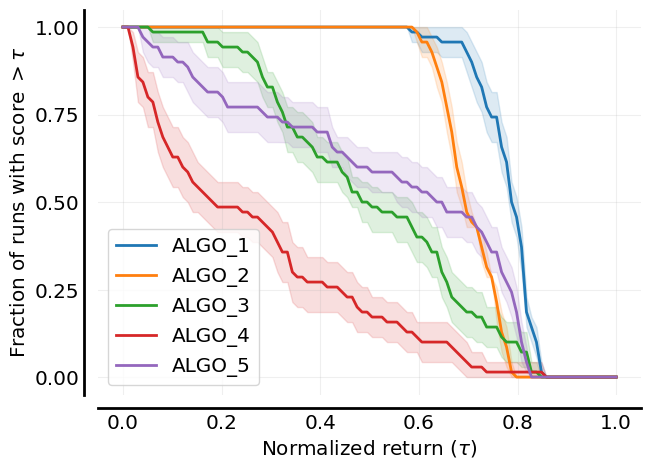

# MARL-eval

<h2 align="center">
    <p>A tool for standardised experiment data aggregation for cooperative multi-agent reinforcement learning</p>
</h2>

<p align="center">
    <a href="https://www.python.org/doc/versions/">
      
    </a>
    <a href="https://badge.fury.io/py/id-marl-eval">
      
    </a>
    <a href="https://github.com/instadeepai/marl-eval/actions/workflows/ci.yaml">
      
    </a>
    <a href="https://github.com/psf/black">
      
    </a>
    <a href="http://mypy-lang.org/">
      
    </a>
    <a href="https://opensource.org/licenses/Apache-2.0">
      
    </a>
</p>

## Welcome to MARL-eval 🧪
`marl-eval` is an open-source Python package for simplifying and standardising the statistical aggregation and plotting of cooperative multi-agent reinforcement learning experimental data.

This repo is the official implementation of the data aggregation guideline proposed in the paper titled _Towards a Standardised Performance Evaluation Protocol for Cooperative MARL_ by [Gorsane et al. (2022)](https://arxiv.org/abs/2209.10485) published at the 36th Conference on Neural Information Processing Systems.

The tools here build upon the tools in the [rliable](https://github.com/google-research/rliable) repo which goes along with the work done by [Agarwal et al. (2022)](https://arxiv.org/abs/2108.13264) in the paper titled _Deep Reinforcement Learning at the Edge of the Statistical Precipice_. For any details on the types of plots produced, please see their work.

## Overview 🦜

- 🪄 **Easy data processing**: Easy-to-use functions that will process all raw experiment data and prepare it for downstream use of the `rliable` tools.
- 📊 **Easy data plotting**: Easy-to-use functions built on top of the `rliable` tools which will handle the plotting of all processed data and produce tabular results in both `.csv` and `LaTeX` formats.


## Installation 🎬

The latest release of the `marl-eval` can be installed as follows:
```bash
pip install id-marl-eval
```
Or to install directly from source:

```bash
pip install "git+https://github.com/instadeepai/marl-eval.git"
```
It should be noted that we have tested `marl-eval` on Python 3.9 and 3.10.

## Quickstart ⚡

We have a quickstart notebook available [here](examples/quickstart.ipynb), alternatively please see the following code snippet for an example of how to process data and to produce a performance profile plot:

```python
# Relevant imports
from marl_eval.plotting_tools.plotting import (
    aggregate_scores,
    performance_profiles,
    probability_of_improvement,
    sample_efficiency_curves,
)
from marl_eval.utils.data_processing_utils import (
    create_matrices_for_rliable,
    data_process_pipeline,
)

# Specify any metrics that should be normalised
METRICS_TO_NORMALIZE = ["return"]

# Read in and process data
with open("data/raw_experiment_results.json", "r") as f:
    raw_data = json.load(f)

processed_data = data_process_pipeline(
    raw_data=raw_data, metrics_to_normalize=METRICS_TO_NORMALIZE
)

environment_comparison_matrix, sample_effeciency_matrix = create_matrices_for_rliable(
    data_dictionary=processed_data,
    environment_name="env_1",
    metrics_to_normalize=METRICS_TO_NORMALIZE,
)

# Generate performance profile plot
fig = performance_profiles(
    environment_comparison_matrix,
    metric_name="return",
    metrics_to_normalize=METRICS_TO_NORMALIZE,
)
```
Leading to the following plot:
<p align="center">
    <a href="docs/images/return_performance_profile.png">
        
    </a>
</p>

For a more detailed example illustrating how multiple plots may be made for various metrics as well as how to aggregate data for a single task in a given environment, please see our [quickstart notebook](examples/quickstart.ipynb) or the following [example script](https://github.com/instadeepai/marl-eval/blob/develop/examples/simple_example.py).

## Usage 🧑‍💻

In order to use the tools, raw experiment data must be in the suggested format and stored in a json file. If given in the correct format, `marl-eval` will aggregate experiment data, plot the results and produce aggregated tabular results as a `.csv` file, in LaTeX table formatting and in the terminal.

<a id="exp_structure"></a>
### Data Structure for Raw Experiment data 📒

In order to use the tools we suggest effectively, raw data json files are required to have the following structure :

```
{
    "environment_name" : {
        "task_name" : {
            "algorithm_name": {
                "run_1": {
                    "step_1" : {
                        "step_count": <int>,
                        "metric_1": [<number_evaluation_episodes>],
                        "metric_2": [<number_evaluation_episodes>],
                    }
                    .
                    .
                    .
                    "step_k" : {
                        "step_count": <int>,
                        "metric_1": [<number_evaluation_episodes>],
                        "metric_2": [<number_evaluation_episodes>],
                    }
                    "absolute_metrics": {
                        "metric_1": [<number_evaluation_episodes>*10],
                        "metric_2": [<number_evaluation_episodes>*10]
                    }

                }
                .
                .
                .
                "run_n": {
                    "step_1" : {
                        "step_count": <int>,
                        "metric_1": [<number_evaluation_episodes>],
                        "metric_2": [<number_evaluation_episodes>],
                    }
                    .
                    .
                    .
                    "step_k" : {
                        "step_count": <int>,
                        "metric_1": [<number_evaluation_episodes>],
                        "metric_2": [<number_evaluation_episodes>],
                    }
                    "absolute_metrics": {
                        "metric_1": [<number_evaluation_episodes>*10],
                        "metric_2": [<number_evaluation_episodes>*10]
                    }
                }
            }
        }
    }
}
```
Here `run_1` to `run_n` correspond to the number of independent runs in a given experiment and `step_1` to `step_k` correspond to the number of logged steps in a given environment. We do not require an independent run to explicitly be named run, users may also name a run using the value of a particular seed that was used as a string. `step_count` corresponds to the amount of steps taken by agents in the environment when logging occurs and the values logged for each relevant metric for a given logging step should be a list containing either 1 element for a metric such as a win rate which gets computed over multiple episodes or as many elements as evaluation episodes that we run at the logging step. The final logging step for a given run should contain the `absolute_metrics` values for the given metric in an experiment with these lists containing either 1 element or 10 times as many elements as evaluation episodes at each logging step. For an explanation of the `absolute metric` please see [paragraph 1 on page 9 here](https://arxiv.org/pdf/2209.10485.pdf).

> 🚧 **Important note on data structure** 🚧
>
> Due to the underlying statistical aggregation relying on `numpy` array operations it is required that all data contain the same number of data points. This implies that, for a given environment, it is required that all experiment trials should be done using the same algorithms, on the same tasks, for the same number of independent runs and for the same amount of evaluation steps. The code will currently check that these conditions are met and will not be able to progress otherwise. In the case that this happens, the `check_data` method of the [`DiagnoseData`](marl_eval/utils/diagnose_data_errors.py) class will be able to tell a user exactly what is causing the issues in their raw experiment data.

> 🚧 **Important note on algorithm names** 🚧
>
> For producing probability of improvement plots, it is important that any algorithm names in the dataset do not contain any commas.

### JSON Data Tooling

[**JSON Logger**](marl_eval/json_tools/json_logger.py): `JsonLogger` handles logging data according to the structured format detailed [above](#exp_structure). This makes it easy to follow our evaluation protocol as files generated by the `JsonLogger` can be directly passed to the plotting tools.

[**Neptune Data Pulling Script**](marl_eval/json_tools/json_utils.py): `pull_neptune_data` connects to a Neptune project, retrieves experiment data from a given list of tags and downloads it to a local directory. This function is particularly useful when there is a need to pull data from multiple experiments that were logged separately on Neptune.

[**JSON File Merging Script**](marl_eval/json_tools/json_utils.py): `concatenate_json_files` reads multiple JSON files from a specified local directory and concatenates their contents into a single structured JSON file.

> 📌 Using `pull_neptune_data` followed by `concatenate_files` forms an effective workflow, where multiple JSON files from different experiment runs are first pulled from Neptune and then merged into a single file, ready for use in marl-eval.

For more details on how to use the JSON tools, please see the [detailed usage guide](docs/json_tooling_usage.md).

### Metrics to be normalised during data processing ⚗️
Certain metrics, like episode returns, are required to be normalised during data processing. In order to achieve this it is required that users give these metric names, in the form of strings in a python list, to the `data_process_pipeline` function, the `create_matrices_for_rliable` function and all plotting functions as an argument. In the case where no normalisation is required this argument may be omitted.

## Contributing 🤝

Please read our [contributing docs](./CONTRIBUTING.md) for details on how to submit pull requests, our Contributor License Agreement and community guidelines.

## Citing MARL-eval

If you use any of these tools in your work and find them useful, please cite the accompanying [paper](https://arxiv.org/abs/2209.10485):

```bibtex
@article{gorsane2022towards,
  title={Towards a Standardised Performance Evaluation Protocol for Cooperative MARL},
  author={Gorsane, Rihab and Mahjoub, Omayma and de Kock, Ruan and Dubb, Roland and Singh, Siddarth and Pretorius, Arnu},
  journal={arXiv preprint arXiv:2209.10485},
  year={2022}
}
```

## See Also 🔎

MARL-eval forms part of **InstaDeep's MARL ecosystem in JAX.** In particular, we suggest users check out the following sister repositories that form a collection of libraries useful for MARL research that integrate well with each other and with MARL-eval:

* 🦁 [Mava](https://github.com/instadeepai/Mava): a research-friendly codebase for distributed MARL in JAX.
* 🔌 [OG-MARL](https://github.com/instadeepai/og-marl): datasets with baselines for offline MARL in JAX.
* 🌴 [Jumanji](https://github.com/instadeepai/jumanji): a diverse suite of scalable reinforcement learning environments in JAX.
* 😎 [Matrax](https://github.com/instadeepai/matrax): a collection of matrix games in JAX.
* 🔦 [Flashbax](https://github.com/instadeepai/flashbax): accelerated replay buffers in JAX.

**Related.** Other libraries related to standardised benchmarking in MARL:

* 🤖 [BenchMARL](https://github.com/facebookresearch/BenchMARL): a collection of MARL benchmarks based on TorchRL.
* 🦊 [JaxMARL](https://github.com/flairox/jaxmarl): accelerated MARL environments with baselines in JAX.
